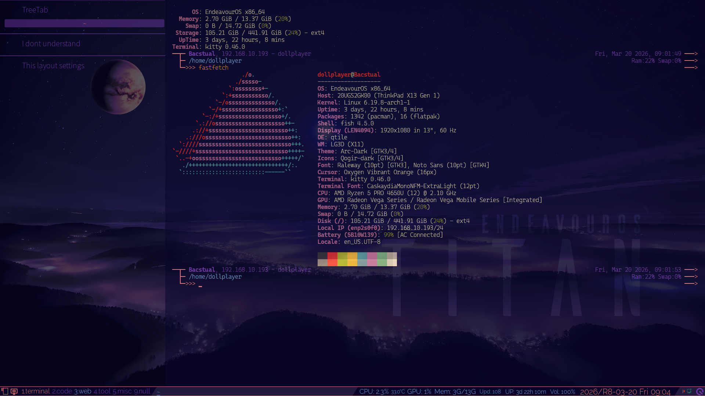
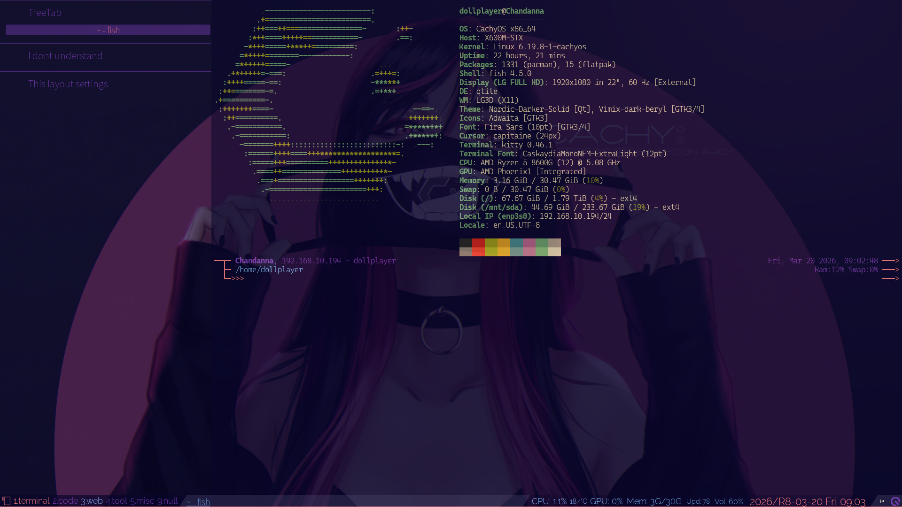
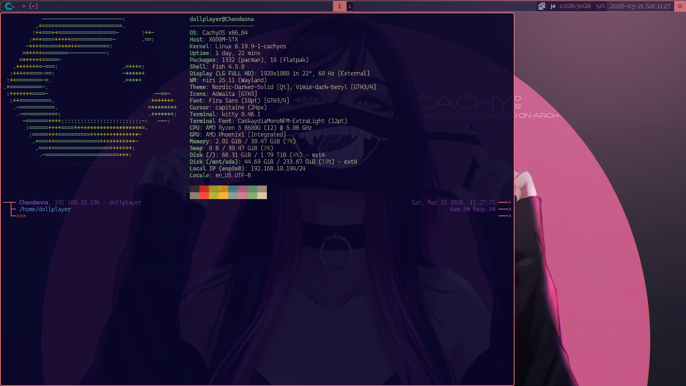

## Who are you?

**[Masahiquo, Naraya MORRY@X/Twitter](https://twitter.com/dollplayer2501)**

> IT土方・電算職（自称）, NOT ENGINEER.  
> Avator: [http://bit.ly/3zaG4iP](http://bit.ly/3zaG4iP)

## What are you interested in?

### A Linux desktop environment centered around Qtile

This is my _ThinkPad X13 Gen 1 (AMD)_, I am building a Qtile environment based on the Xfce4 environment on EndeavourOS.

And then, in the winter of 2025, I added _ASRock DeskMini X600_, currently, I'm still making adjustments, but I've installed Niri and Qtile on CachyOS.

 

## (Currently on hiatus) Web development centered around Eleventy/11ty

 

- **Left side**  
  [dollplayer2501/project2501-v3: @dollplayer2501's portal and portfolio site, build with 11ty/Eleventy and Gulp.](https://github.com/dollplayer2501/project2501-v3)
- **Right side**  
  [dollplayer2501/Eleventy-netlify-V2: My blog-like site using Eleventy.](https://github.com/dollplayer2501/Eleventy-netlify-V2)

## What kind of environment do you work in?

- **PC/Hardware** and **OS**
  - ThinkPad X13 Gen 1 (AMD), RAM 16GB  
    Qtile on Xfce4 on EndeavourOS
  - ASRock DeskMini X600, AMD Ryzen 5 8600G, RAM 32GB  
    Niri and Qtile on CachyOS
  - Synology DS223j
- **Applications being used**  
  Kitty terminal, Fish shell, Starship, LazyVim, Ranger, Python, ImageMagick, Ffmpeg, etc.
- **Purpose of use**  
  To be honest, it's because "I enjoy setting up environments on Linux." Furthermore, for example, daily use, such as for SNS and development.  
  I used to use Windows and macOS, but I don't use them anymore. However, if I needed them again, I would probably use them _again_.
