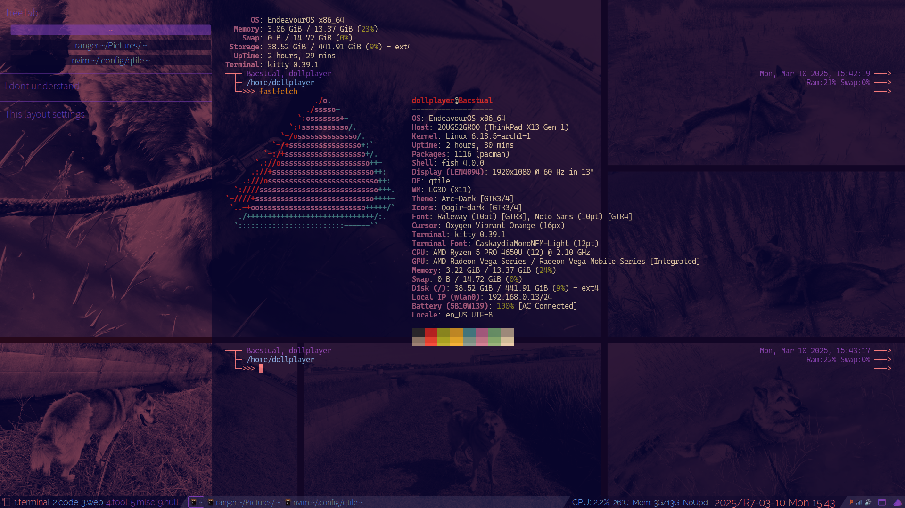
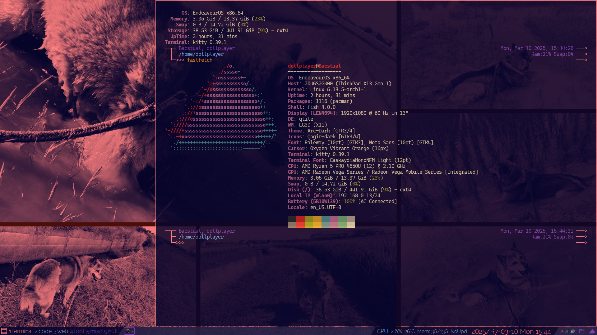
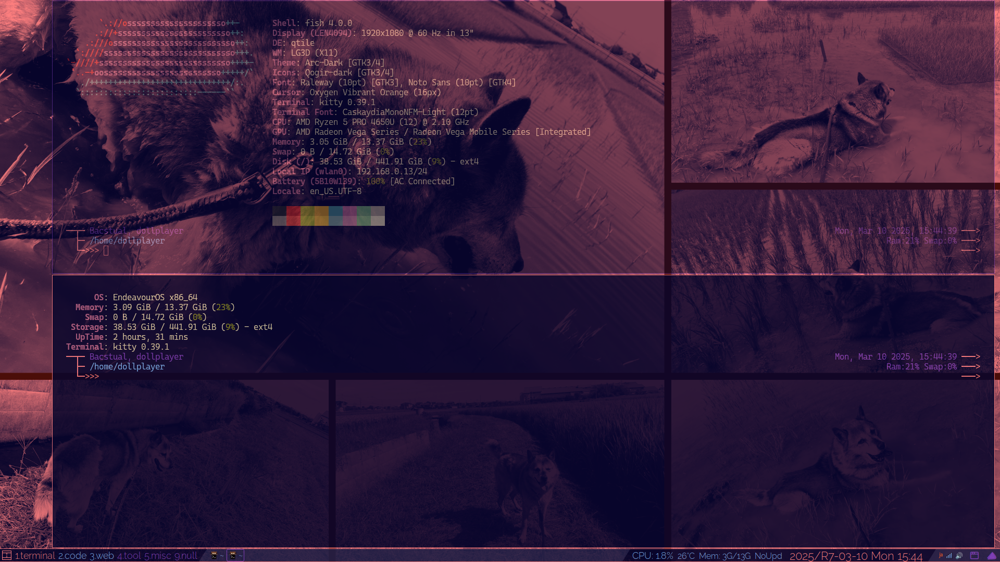

## Who are you?

**[Masahiquo, Naraya MORRY@X/Twitter](https://twitter.com/dollplayer2501)**

> IT土方・電算職（自称）, NOT ENGINEER.  
> Avator: [http://bit.ly/3zaG4iP](http://bit.ly/3zaG4iP)

## What are you interested in?

  

As of the end of February 2025, I am focusing on setting up the environment on [EndeavourOS](https://endeavouros.com/) with [Qtile](https://qtile.org/).  

 

For this reason, website production using [Eleventy](https://www.11ty.dev/) is currently on hold.  
Currently, the environment settings on EndeavourOS are finally complete.  
Separately from that, I would also like to increase my writing on **[Zenn](https://zenn.dev/dollplayer2501)** if possible.  

## What kind of environment do you work in?

- **PC/Hardware**  
ThinkPad X13 Gen 1 (AMD), RAM 16GB
- **OS**  
EndeavourOS, Endeavour Neo
- **DE/WM**  
Qtile on Xfce4
- **Shell, etc.**  
Kitty, Alacritty, fish shell with fisher, Starship, Neovim with lazy.nvim, Ranger with Überzug++, etc.
- **Purpose of use**  
Daily use, such as for SNS and development.  
Apart from this, I also have a Windows desktop machine, which I use for other things besides SNS, such as browsing video sites.

