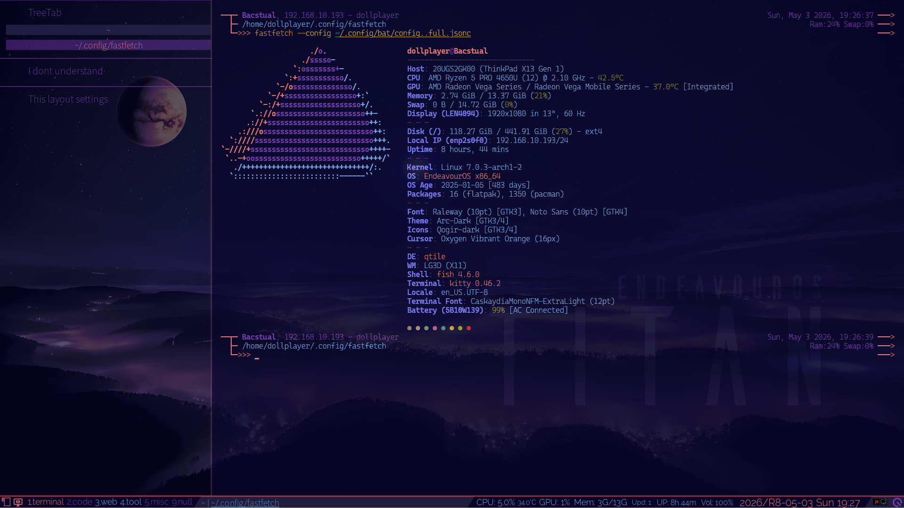
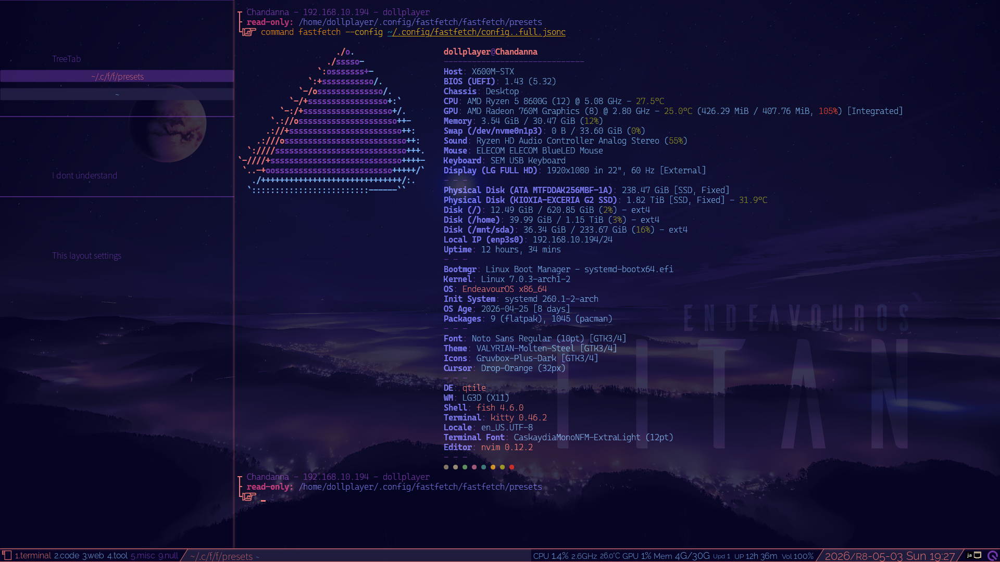

## Who am I?

**[Masahiquo, Naraya MORRY@X/Twitter](https://twitter.com/dollplayer2501)**

> IT土方・電算職（自称）, NOT ENGINEER.  
> Avator: [http://bit.ly/3zaG4iP](http://bit.ly/3zaG4iP)

## What am I interested in?

### #1: A Linux desktop environment centered around Qtile

The current deliverables are as follows:

- (dotfiles_ver3_terminal)[https://github.com/dollplayer2501/dotfiles_ver3_terminal]
- dotfiles_ver3_window-manager... coming soon

My current PC setup consists of the following two computers:

### 1: ThinkPad X13 Gen 1 (AMD), RAM 16GB

Qtile on Xfce4 on EndeavourOS

### 2: ASRock DeskMini X600, AMD Ryzen 5 8600G, RAM 32GB

From Niri and Qtile on CachyOS to Qtile on Xfce4 on EndeavourOS

### 3: etc.

- Since my current environment doesn't pose any problems, I've stopped using both Windows and macOS.
- I have started using the Synology DS223j.
- I switched from an iPhone to an Android phone.

### #2: (Currently on hiatus) Web development centered around Eleventy/11ty

 

- **Left side**  
  [dollplayer2501/project2501-v3: @dollplayer2501's portal and portfolio site, build with 11ty/Eleventy and Gulp.](https://github.com/dollplayer2501/project2501-v3)
- **Right side**  
  [dollplayer2501/Eleventy-netlify-V2: My blog-like site using Eleventy.](https://github.com/dollplayer2501/Eleventy-netlify-V2)
